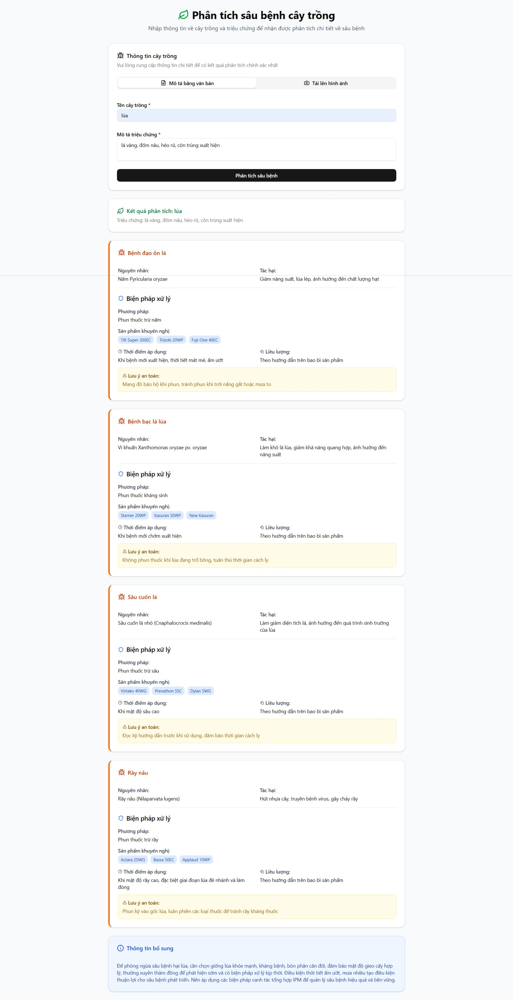
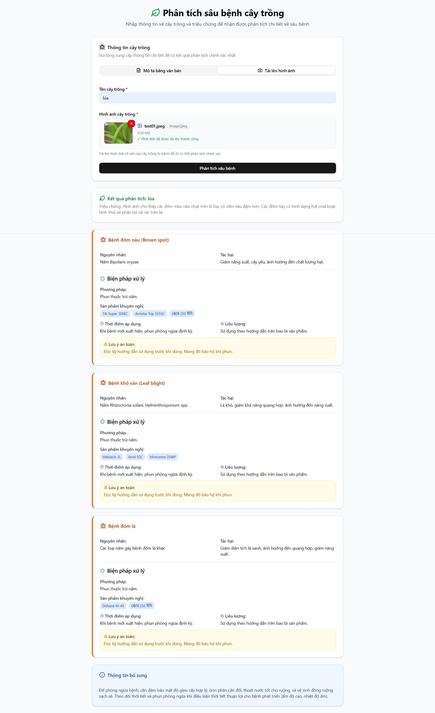

# Pesticides Analysis App

A Next.js application for analyzing plant pests and diseases using AI. Users can input crop information and symptoms to receive detailed analysis and treatment recommendations.

## Features

- **Dual Analysis Modes**: 
  - **Text Mode**: Traditional input with crop type and symptom description
  - **Image Mode**: Upload plant images for AI-powered visual analysis
- **AI-Powered Analysis**: Get detailed pest/disease identification using Google AI (Gemini)
- **Image Upload**: Drag & drop or click to upload plant images (JPG, PNG, GIF up to 10MB)
- **Treatment Recommendations**: Comprehensive treatment plans including:
  - Treatment methods
  - Recommended products
  - Application timing and dosage
  - Safety notes
- **Modern UI**: Built with shadcn/ui components and responsive design
- **Loading States**: Smooth user experience with loading indicators
- **Error Handling**: Comprehensive error handling and validation

## Application Demo

### 📝 Text Analysis Mode
Users can describe their plant's symptoms and get detailed analysis:



**Features shown:**
- Crop type input field
- Detailed symptom description
- Real-time validation with React Hook Form
- Comprehensive analysis results with treatment recommendations

### 📷 Image Analysis Mode
Advanced visual analysis by uploading plant images:



**Features shown:**
- Drag & drop image upload interface
- Image preview and validation
- AI-powered visual disease detection
- Detailed pest identification with treatment plans

Both modes provide:
- ✅ **Comprehensive Analysis**: Disease/pest identification with confidence levels
- 🛡️ **Treatment Plans**: Step-by-step treatment methods and product recommendations
- ⏰ **Application Timing**: When and how to apply treatments
- ⚠️ **Safety Guidelines**: Important safety notes and precautions

## Getting Started

### Prerequisites

- Node.js 18+ 
- npm or yarn

### Installation

1. Clone the repository:
```bash
git clone <repository-url>
cd pesticides
```

2. Install dependencies:
```bash
npm install
```

3. Set up environment variables:
```bash
cp .env.local.example .env.local
```

4. Start the development server:
```bash
npm run dev
```

5. Open [http://localhost:3000](http://localhost:3000) with your browser.

## AI Integration

Currently, the app uses mock data for demonstration. To integrate with a real AI service:

### Option 1: Google AI (Gemini)

1. Get an API key from [Google AI Studio](https://aistudio.google.com/)
2. Add to `.env.local`:
```bash
GOOGLE_AI_API_KEY=your_api_key_here
```

3. Uncomment and modify the API call in `src/app/api/analyze-pest/route.ts`:
```typescript
const response = await fetch('https://generativelanguage.googleapis.com/v1beta/models/gemini-pro:generateContent', {
  method: 'POST',
  headers: {
    'Content-Type': 'application/json',
    'Authorization': `Bearer ${process.env.GOOGLE_AI_API_KEY}`
  },
  body: JSON.stringify(aiPrompt)
});
```

### Option 2: OpenAI

1. Get an API key from [OpenAI](https://platform.openai.com/)
2. Install OpenAI SDK:
```bash
npm install openai
```

3. Modify the API route to use OpenAI's structured output format

### Option 3: Other AI Services

The app is designed to work with any AI service that can return structured JSON. The prompt and schema are provided in the API route for easy integration.

## Project Structure

```
src/
├── app/
│   ├── api/analyze-pest/    # API route for pest analysis
│   ├── globals.css          # Global styles
│   ├── layout.tsx           # Root layout
│   └── page.tsx             # Main page
├── components/
│   ├── ui/                  # shadcn/ui components
│   └── pest-analysis-form.tsx # Main form component
├── types/
│   └── pest-analysis.ts     # TypeScript types
└── lib/
    └── utils.ts             # Utility functions
```

## API Schema

The AI response must follow this exact schema:

```typescript
interface PestAnalysisResponse {
  cropType: string;
  cropSymptom: string;
  possiblePestsOrDiseases: Array<{
    name: string;
    cause: string;
    impact: string;
    treatment: {
      method: string;
      recommendedProducts: string[];
      applicationTiming: string;
      dosage: string;
      safetyNotes: string;
    };
  }>;
  additionalInfo: string;
}
```

## Technologies Used

- **Framework**: Next.js 15 with App Router
- **UI Components**: shadcn/ui
- **Styling**: Tailwind CSS
- **Icons**: Lucide React
- **Language**: TypeScript

## Development

- `npm run dev` - Start development server
- `npm run build` - Build for production
- `npm run start` - Start production server
- `npm run lint` - Run ESLint

## Contributing

1. Fork the repository
2. Create a feature branch
3. Make your changes
4. Add tests if applicable
5. Submit a pull request

## License

MIT License
